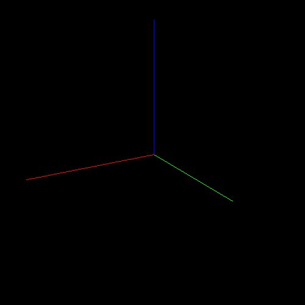
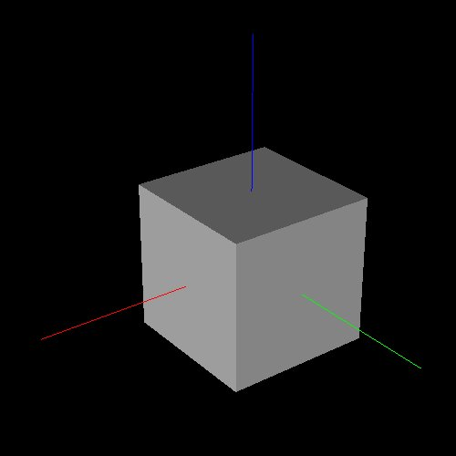
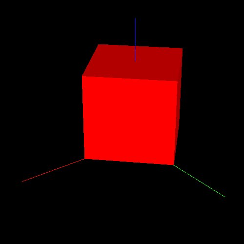
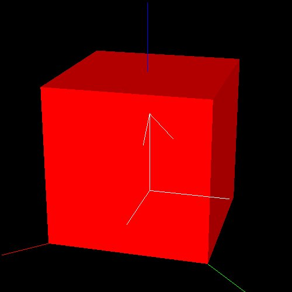
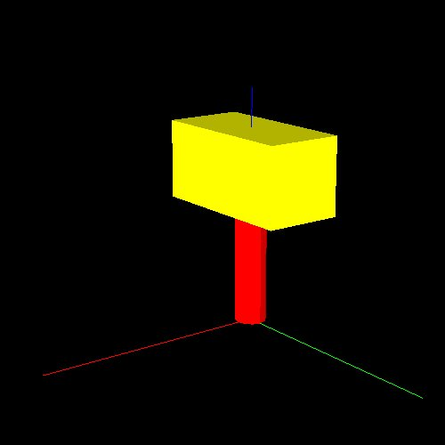
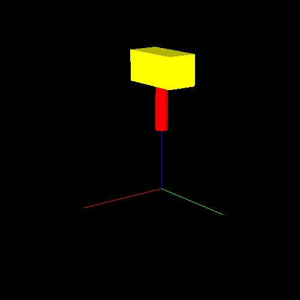

# Geometric Coding

EusLisp have a solid library for geometric calculation.
The explanation below is for irteusgl and afterwards (including roseus).


## 3D Viewer

3D Viewer can be launched with
```
(make-irtviewer)
```



This viewer can be accessed by the global variable `*irtviewer*`
The view angle can be changed by dragging around the center.
The left and bottom sides are used to adjust the view point.
The right and top sides are used to zoom in and out.
It differs from the most 3D software, so please be aware of the above.

The viewer can be updated by clicking it or using `:draw-objects`, which is particularly necessary for loop animations.

```
(send *irtviewer* :draw-objects)
```

Updating the objects usually do not cause the viewer to get updated.
The following is used to allow mouse interruption during loop animation.

```
(x::window-main-one)
```


## Basic solids

The following create a cube with border 100 mm
```
(setq *cube* (make-cube 100 100 100))
```

which is send to the viewer by
```
(objects (list *cube*))
```




Color can be changed with `:set-color`.
```
(send *cube* :set-color :red)
```

The following change the cube's position and pose.

```
(send *cube* :translate (float-vector 0 0 50))
(send *cube* :rotate (/ pi 4.0) :z)
```
`float-vector` is a function to create a vector.
Differently from lists, vectors can only store elements of the same type.

When the viewer is clicked or `draw-objects` gets called, the viewer is updated.




Similarly, `make-cylinder`,`make-cone` and other functions are provided.
Details are given in [Basic body functions (Japanese)].

[Basic body functions (Japanese)]: http://euslisp.github.io/jskeus/jmanual-node118.html


## Vector operations

Simple operations can be performed with `v+`,`v-`,`v.`,`v*`. `v++` is used to sum more than two vectors.

```
(setq *v0* (float-vector 1 2 3)
      *v1* (float-vector 4 5 6))
(print (v+ *v0* *v1*))
(print (v- *v0* *v1*))
(print (v. *v0* *v1*))  ;; 内積
(print (v* *v0* *v1*))  ;; 外積
```

`scale` is used to multiply by a scalar.
```
(scale 10.0 *v0*)
```

Vector elements can be accessed with `elt`. List operations such as `nth` and `car` cannot be used.

Objects created with `float-vector` are represented with `#f()`, which can also be used to access immediate values. However, **it is not recommended to change elements of vectors created with `#f()`**.


## Coordinate system

Next, try this:
```
(send *cube* :coords)
```
It should return something like the following object.
```
#<coordinates #X6890ff8  0.0 0.0 50.0 / 0.785 0.0 0.0>
```

This is a `coordinate` object, which can be transformed by homogeneous coordinate transformations like the above `:translate` and `:rotate`.

To copy such objects, `:copy-coords` is used.
```
(send *cube* :copy-coords)
```

To make new coordinates, `make-coords` is used.
```
(setq *co* (make-coords))
```

Translation is made with `:translate`.
```
(send *co* :translate (float-vector 10 20 30))
```

The easiest way to change the coordinate attitude is to `:rotate` around an axis.
```
(send *co* :rotate (/ pi 4.0) :z)
```
The above rotates 4/PI rad (45 deg) around the z axis.
(`deg2rad` and `rad2deg` can be used for conversion between radian and degree)

It is also possible to visualize coordinates.
```
(objects (list *cube* *co*))
```




### Vector transformations using coordinates

It is possible to transform a vector into a certain coordinate system with the following:
```
(setq *vec* (float-vector 100 0 50))
(send *co* :transform-vector *vec*)
```
Here, the result is the vector equivalent to `*vec*` with origin in `*co*`.
```
#f(80.7107 90.7107 80.0)
```


### Coordinate transformations using other coordinates

For example:

```
(setq *co2* (make-coords))
(send *co2* :translate (float-vector 100 0 0))
(send *co2* :rotate pi :x)
(send *co* :transform *co2*)
```
The result is the coordinate equivalent to `*co2*` with origin in `*co*`.
This value is also stored in `*co*`.
```
#<coordinates #X68a8e38  80.711 90.711 30.0 / 0.785 6.163e-33 3.142>
```


## Linked coordinate systems

Until now we only dealt with single coordinate systems.
By using `cascaded-coords`, it is possible to express linked coordinate systems.
That is, when the parent coordinate is moved, child coordinate systems move the same way.
Instead of `make-coords`, `make-cascoords` is used.

```
(setq *casco* (make-cascoords))
(setq *casco2* (make-cascoords :pos (float-vector 100 0 0) :parent *casco*))
```
In the above, `*casco*` and `*casoco2*`are created and linked.
It is also possible to link already created coordinates with `:assoc`.

In the following, translating the parent `*casco*` also causes `casco2*` to be moved the same way.
```
(send *casco* :translate (float-vector 0 0 100))
;; #<cascaded-coords #X690b528  0.0 0.0 100.0 / 0.0 0.0 0.0>
*casco2*
;; #<cascaded-coords #X6a0ece8  100.0 0.0 100.0 / 0.0 0.0 0.0>
```

Instead, try to move the child coordinate:
```
(send *casco2* :translate (float-vector 0 100 0))
;; #<cascaded-coords #X6a0ece8  100.0 100.0 100.0 / 0.0 0.0 0.0>
```
In this case, `*casco*` does not move.
```
*casco*
;; #<cascaded-coords #X690b528  0.0 0.0 100.0 / 0.0 0.0 0.0>
```

## Linking bodies

Bodies can be linked with `:assoc`, similarly to coordinates.

```
(setq *stick* (make-cylinder 10 100))
(send *stick* :set-color :red)
(setq *body* (make-cube 50 100 50))
(send *body* :translate (float-vector 0 0 100))
(send *body* :set-color :yellow)
(send *stick* :assoc *body*)
(objects (list *body* *stick*))
```



Both objects are displayed.
If we try to move `*stick*`, both objects get moved.
```
(send *stick* :translate (float-vector 0 0 100))
(send *irtviewer* :draw-objects)  ;; Update viewer
```




However, the coordinates of `*body*` seem to be unchanged:
```
(send *body* :coords)
;; #<coordinates #X6b3d9f8  0.0 0.0 100.0 / 0.0 0.0 0.0>
```
This is because `:coords` returns the coordinates relative to the parent, which remain unaltered. To get the global coordinates, `:worldcoords` is used.
```
(send *body* :worldcoords)
;; #<coordinates #X6a93e88  0.0 0.0 200.0 / 0.0 0.0 0.0>
```

Global coordinates can be copied with `:copy-worldcoords`.
```
(send *body* :copy-worldcoords)
```


