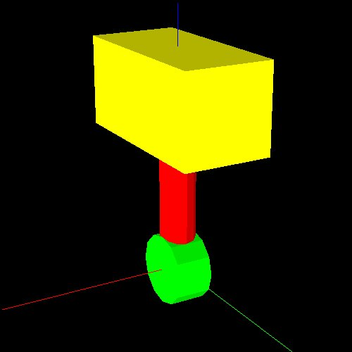
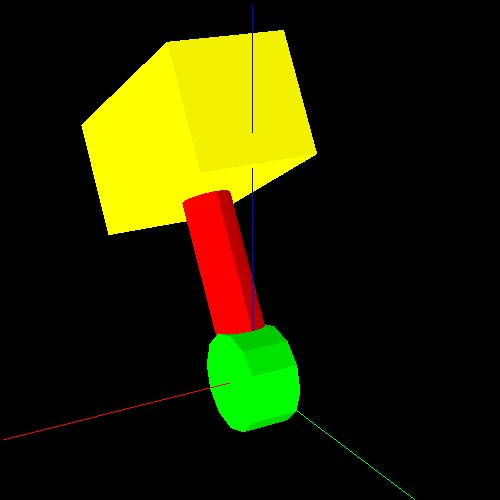
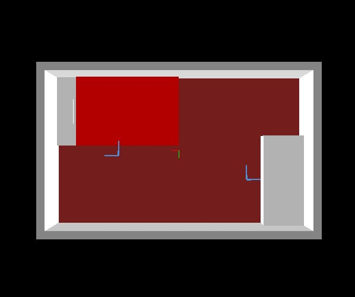

# Modeling

irteus拡張のモデルを作りましょう．


## 形状モデル(bodyset)

`bodyset`は，複数の`body`をひとまとめにできる基底クラスです．
これを用いると，[geo_coding](geo_coding.md)で記述した物体オブジェクトは
以下のように書き換えることができます．

```
(setq *stick* (make-cylinder 10 100))
(send *stick* :set-color :red)
(setq *body* (make-cube 50 100 50))
(send *body* :translate (float-vector 0 0 100))
(send *body* :set-color :yellow)
(send *stick* :assoc *body*)
(setq *hammer*
      (instance bodyset :init (make-cascoords)
                :bodies (list *stick* *body*)))
(objects (list *hammer*))
```

## 多リンクモデル(cascaded-link)

`cascaded-link`は多リンクモデルを記述する際の基底となります．
例えば，[robot_coding](robot_coding.md)で出てきた`samplerobot`の場合，
`(send *sr* :rarm)`で得られるオブジェクトは`cascaded-link`になっています．

`cascaded-link`では，
`bodyset-link`クラスでリンク情報を，
`joint`クラスで関節情報を記述します．


### bodyset-link

`bodyset-link`は，`joint`で接続可能なリンク構造を表現できる基底クラスです．
`bodyset-link`そのものは`bodyset`の子クラスとなっているため，
作り方は同じです．

### joint

`joint`はその名の通り関節を記述する基底クラスです．
`rotational-joint`,`linear-joint`などがあります．
`:init`の際に`:parent-link`,`:child-link`を与えることで
`bodyset-link`をつなぐことができます．
注意点として，動作の基準となるのは`child-link`の座標系となります．

### 多リンクモデルの作り方

`cascaded-link`を継承したクラスを作って他リンクモデルを作ります．

`:init`の中では以下の手順を踏みます．

- `bodyset-link`のオブジェクトを作る．
- `bodyset-link`をつないだ`joint`のオブジェクトを作る．
- `self`にルートリンクを，あとは順番に`bodyset-link`同士を`:assoc`でつなぐ．
- `links`というメンバ変数に`bodyset-link`のオブジェクトのリストを代入する．
- `joint-list`というメンバ変数に`joint`のオブジェクトのリストを代入する．
- 最後に`:init-ending`する．

例として，これまでに作ったハンマーを動かせる一軸のハンドを作ってみましょう．

```
(defclass hammer-hand
  :super cascaded-link
  :slots (hammer hand j0))
(defmethod hammer-hand
  (:init
   (&rest args)
   (send-super* :init args)
   (let (hammer-stick hammer-body hammer-stick2 hand-co)
     ;; bodyset-link をつくる
     (setq hammer-stick (make-cylinder 10 100))
     (send hammer-stick :set-color :red)
     (setq hammer-body (make-cube 50 100 50))
     (send hammer-body :translate (float-vector 0 0 100))
     (send hammer-body :set-color :yellow)
     (send hammer-stick :assoc hammer-body)
     (setq hammer
           (instance bodyset-link :init (make-cascoords)
                     :bodies (list hammer-stick hammer-body)))

     (setq hammer-stick2 (make-cylinder 20 20))
     (send hammer-stick2 :set-color :green)
     (send hammer-stick2 :rotate (deg2rad 90) :y)
     (send hammer-stick2 :translate (float-vector 0 0 -10))
     (setq hand
           (instance bodyset-link :init (make-cascoords)
                     :bodies (list hammer-stick2)))

     ;; joint をつくる
     (setq j0
           (instance rotational-joint :init
                     :parent-link hand
                     :child-link hammer
                     :axis :x))

     ;; ルートから順番に assoc
     (send self :assoc hand)
     (send hand :assoc hammer)

     ;; links, joint-list は cascaded-link で宣言されている
     (setq links (list hand hammer))
     (setq joint-list (list j0))

     ;; 忘れずに
     (send self :init-ending)
     )
   self)
  ;; 各関節にアクセスするためのメソッド
  (:hand (&rest args) (forward-message-to j0 args))
  )

(setq *hammer-hand*
      (instance hammer-hand :init))
(objects (list *hammer-hand*))
```



関節角度は以下のように変えることができます．
```
(send *hammer-hand* :hand :joint-angle 30)
```




## ロボットモデル(robot-model)

`robot-model`を用いることで，
他リンクモデルを複数持つロボットを定義することができます．


## 環境モデル(scene-model)

`scene-model`は環境モデルの基底となるクラスです．
このクラスを継承し，`:objects`にここまでに作った物体モデルと，
`cascaded-coords`で立ち位置(spot)を与えることができます．

例えば，以下のように部屋のモデルを作ることができます．

```
(defclass myroom-scene
  :super scene-model
  :slots ())
(defmethod myroom-scene
  (:init
   (&rest args &key (name "myroom"))
   (let (objs wall0 wall1 wall2 wall3 floorpanel walls
              table bed bed-base blaket pillow
              tablespot bedspot)
     (setq wall0 (make-cube 5300 150 2000)
           wall1 (make-cube 150 3000 2000)
           wall2 (make-cube 5300 150 2000)
           wall3 (make-cube 150 3000 2000)
           floorpanel (make-cube 5300 3300 100))
     (send floorpanel :translate (float-vector 0 0 -50))
     (send wall0 :translate (float-vector 0 1575 1000))
     (send wall1 :translate (float-vector 2575 0 1000))
     (send wall2 :translate (float-vector 0 -1575 1000))
     (send wall3 :translate (float-vector -2575 0 1000))
     (send floorpanel :set-color :brown)
     (send wall0 :set-color :gray)
     (send wall1 :set-color :gray)
     (send wall2 :set-color :gray)
     (send wall3 :set-color :gray)
     (send floorpanel :assoc wall0)
     (send floorpanel :assoc wall1)
     (send floorpanel :assoc wall2)
     (send floorpanel :assoc wall3)
     (setq walls (instance bodyset :init (make-cascoords)
                           :name "wall"
                           :bodies (list floorpanel wall0 wall1 wall2 wall3)))

     (setq table (make-cube 800 1800 700 :name "table"))
     (send table :translate (float-vector -2100 600 350))
     (send table :set-color :white)

     (setq bedbase (make-cube 2500 1400 350)
           blanket (make-cube 2100 1400 100)
           pillow (make-cube 300 500 100))
     (send bedbase :translate (float-vector 0 0 175))
     (send blanket :translate (float-vector -200 0 400))
     (send pillow :translate (float-vector 1050 0 400))
     (send bedbase :set-color :white)
     (send blanket :set-color :red)
     (send pillow :set-color :white)
     (send bedbase :assoc blanket)
     (send bedbase :assoc pillow)
     (setq bed (instance bodyset :init (make-cascoords)
                         :name "bed"
                         :bodies (list bedbase blanket pillow)))
     (send bed :translate (float-vector 1250 -800 0))

     (setq tablespot (make-cascoords :name "table-spot")
           bedspot (make-cascoords :name "bed-spot"))
     (send tablespot :translate (float-vector -1400 600 0))
     (send tablespot :rotate pi :z)
     (send bedspot :translate (float-vector 1250 100 0))
     (send bedspot :rotate -pi/2 :z)


     (setq objs (list walls table bed tablespot bedspot))
     (send-super :init :name name :objects objs)
     )
   self)
  )

(setq *myroom* (instance myroom-scene :init))
(objects (list *myroom*))

     (send tablespot :translate (float-vector -1400 600 0))
     (send tablespot :rotate pi :z)
     (send bedspot :translate (float-vector 1250 100 0))
     (send bedspot :rotate -pi/2 :z)


     (setq objs (list walls table bed tablespot bedspot))
     (send-super :init :name name :objects objs)
     )
   self)
  )

(setq *myroom* (instance myroom-scene :init))
(objects (list *myroom*))
```




`scene-model`の最大の利点は，
環境を構成する各オブジェクトとスポットを名前で指定して呼び出すことができることです．
この場合だと，

```
(send *myroom* :object "bed")
```

とすると，ベッドのオブジェクトが返ってきます．また，

```
(send *myroom* :spot "bed-spot")
```

とすると，ベッド脇のスポットが返ってきます．
